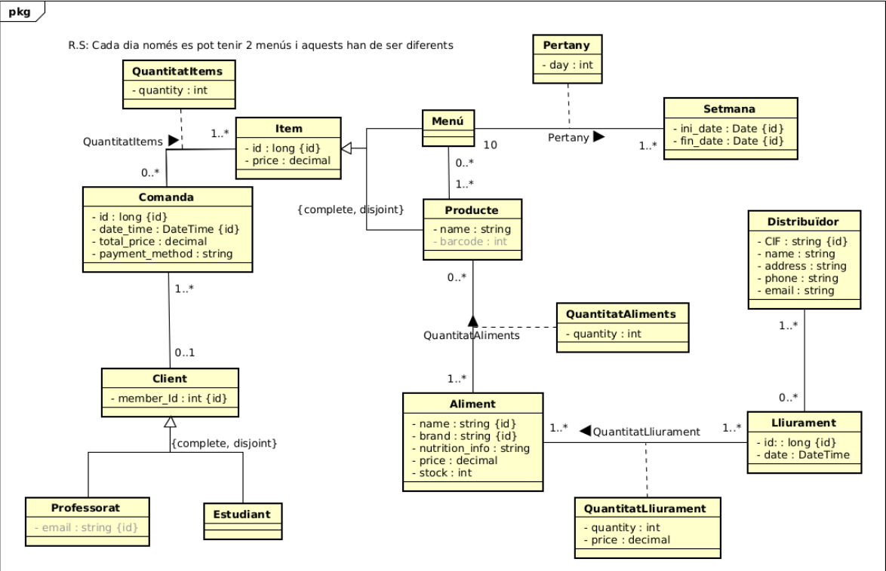
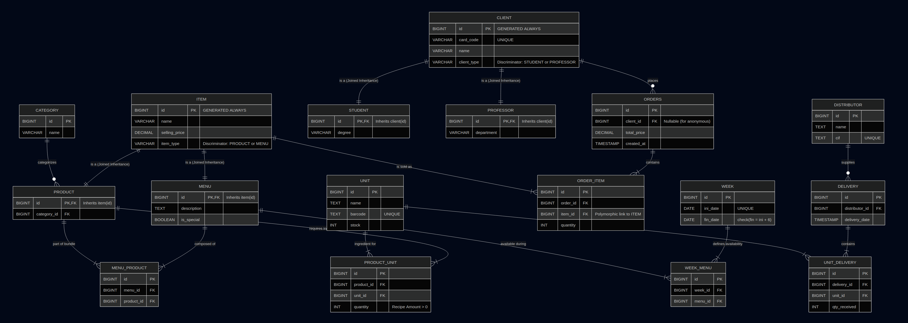

## University Cafeteria System (Refactor & Modernization)
### Overview

This project is a complete architectural redesign and migration of a University Cafeteria Management System.

Originally developed using a modern Python stack (FastAPI, Pydantic, SQLAlchemy), the system was re-engineered using 
Java Spring Boot and PostgreSQL. The goal was to transition from a flexible, lightweight architecture to a robust, 
strictly-typed enterprise environment, implementing advanced patterns for polymorphism, data integrity, and scalability.
[Original Repository](https://github.com/maryupc/CafeteriaESPEVG/tree/develop)

### Database Designs

#### Old Design

#### New Design

#### Author
Joel Esteller | Computer Engineering Student
